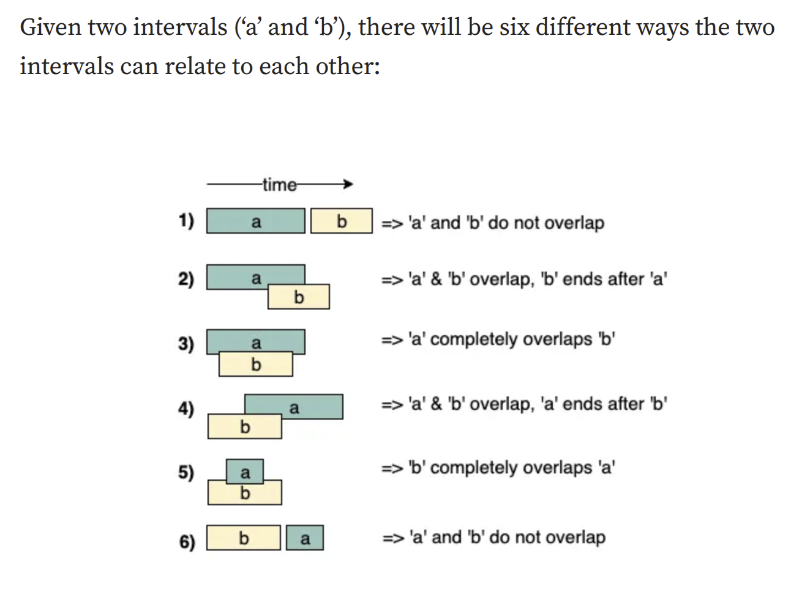

# Problem Solving Patterns
A collection of common problem solving patterns used in coding interviews, written in Python. Each pattern has an explanation (usage, pros and cons, typical problems) and, where available, a working implementation plus solved LeetCode problems. Knowing these patterns makes it easier to recognise which approach a question needs just by reading it.

## Getting started
```bash
git clone https://github.com/abdursujon/problem-solving-patterns.git
cd problem-solving-patterns
python3 src/sliding_window/sliding_window_leetcode.py   # run any file directly
```

To get the latest changes:
```bash
git pull origin main
```
## Patterns Covered (Including Leetcode Problems and Solutions) 

#### Hashing 

- How to build a dictionary from scratch ✅

- How to build a set from scratch 


#### LinkedList 

- How to build a LinkedList from scratch 

- In-place reversal of LinkedList ✅


#### Two pointers 

- Two Pointers template ✅

- Fast and Slow Pointers template ✅


#### Sliding Window 

- Sliding Window Template ✅


#### Searching 

- Binary Search Template ✅

- Modified binary search and how to modify it to solve LeetCode ✅

- Tree Depth First Search ✅

- Tree Breadth First Search ✅


#### Merge Patterns 

- Merge Intervals 

- K Way Merge 


#### Sorting 

- Cyclic Sort

- Topological Sort


#### Matrix Traversal

#### Monotonic Stack

#### Backtracking

#### Subsets

#### Knapsack

#### Bitwise XOR

#### Two Heaps

#### Top K Elements